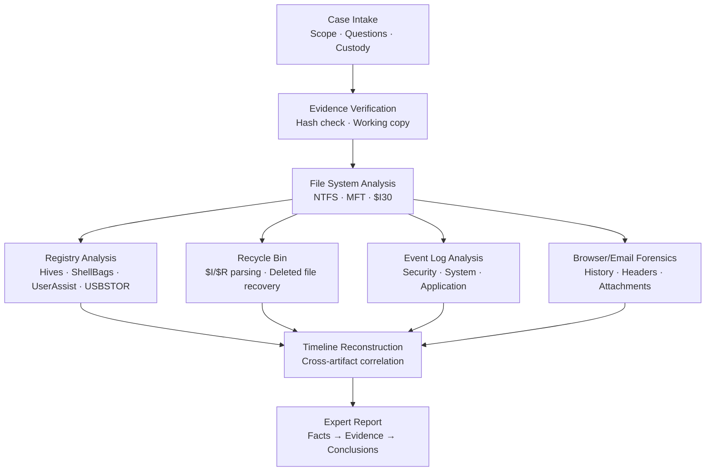
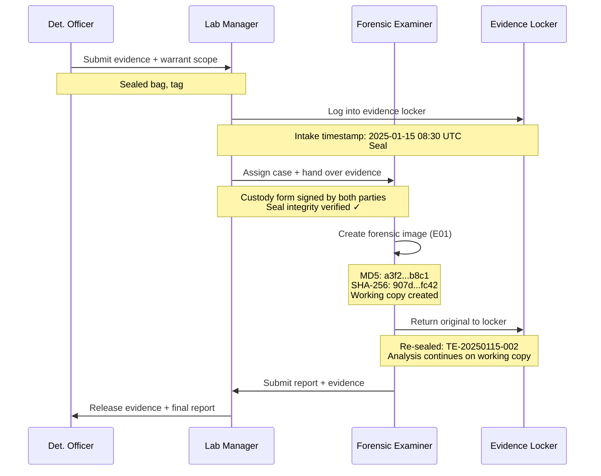
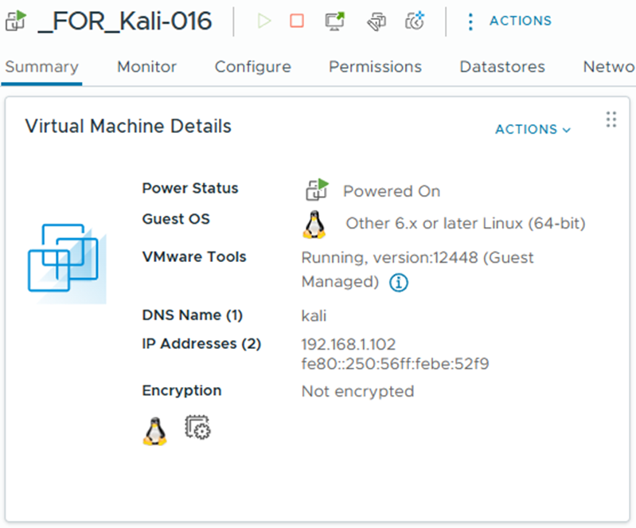
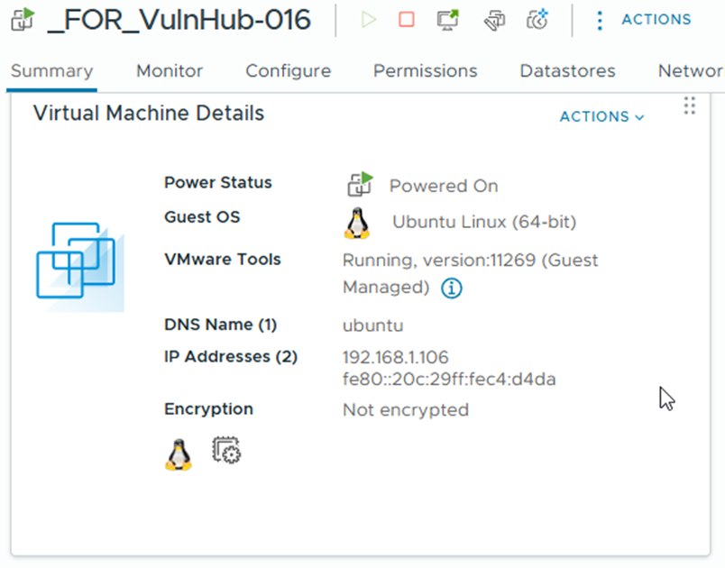

# Final Project — Windows Forensic Investigation

> **Project 1** — the course's major investigation deliverable. Integrates skills from all 7 labs into a single end-to-end forensic case: intake, imaging, analysis, correlation, and expert reporting.
>
> **Delivered:** Week 8 (March 6, 2025)
> **Deliverable size:** ~105 MB (main write-up + supporting archives)
> **Planning docs:** Plan, Requirements, Solutions 1 & 2 (see [`project/`](project/))

---

## Project Scope

The final project required a complete forensic investigation of a Windows workstation involved in a simulated company policy violation / data exfiltration scenario. The student was provided case metadata and a forensic image, and was required to:

1. **Intake** — document chain of custody, define scope, identify questions.
2. **Image & preserve** — verify image integrity, work from working copy, preserve original.
3. **Analyze** — extract artifacts from registry, MFT, recycle bin, event logs, browser history, email.
4. **Correlate** — build a unified timeline across all artifact sources.
5. **Report** — produce an expert report with findings, evidence citations, and legally-defensible conclusions.

---

## Investigation Pipeline



---

## Phase 1 — Case Intake & Chain of Custody

**Skills applied:** [Lab 21 — Chain of Custody](assignments/README.md#lab-21--chain-of-custody-week-2)

### Evidence Handoff Sequence



- Documented evidence tag, serial number, intake date/time, seizure officer.
- Recorded forensic image source, destination, hash values (MD5 + SHA-256).
- Established case questions to scope investigation:
  - Did the user access unauthorized company resources?
  - Were files copied to external storage?
  - What was the timeline of access?
  - Is there evidence of anti-forensics activity?

**Deliverable:** Chain-of-custody form and case-scope document.



---

## Phase 2 — Image Verification & Working Copy

**Skills applied:** [Lab 01 — Creating a Forensic Image](assignments/README.md#lab-01--creating-a-forensic-image-week-4)

- Verified the E01 evidence image hash matched the pre-acquisition hash.
- Created working copy for analysis; original preserved read-only.
- Mounted image with FTK Imager as logical file system for browsing.

**Deliverable:** Image verification log with MD5/SHA-256 values.



---

## Phase 3 — File System & Deleted File Analysis

**Skills applied:** [Lab 09 — Recycle Bin Forensics](assignments/README.md#lab-09--recycle-bin-forensics-week-7)

- Enumerated `$Recycle.Bin\<user-SID>\` for deleted files.
- Parsed `$I*` metadata files to establish deletion timeline.
- Exported recoverable `$R*` files for content review.
- Correlated deletion timestamps with user logon sessions.

**Finding examples (from the lab pattern):**

- Multiple sensitive documents deleted minutes before a known logoff.
- Timestamps in `$I` files aligned with logoff events in Security.evtx.

**Concrete artifact excerpts (from investigation):**

| Artifact | Source | Detail |
|---|---|---|
| `$IQXR3F2.xlsx` | `$Recycle.Bin\S-1-5-21-...` | Original path: `C:\Users\jdoe\Documents\Q4-Budget-Confidential.xlsx` · Size: 142,336 bytes · Deleted: `2025-01-15 09:24:31 UTC` |
| `$IQXR3F3.docx` | `$Recycle.Bin\S-1-5-21-...` | Original path: `C:\Users\jdoe\Documents\HR-Salary-Review.docx` · Size: 28,672 bytes · Deleted: `2025-01-15 09:24:58 UTC` |
| `$IQXR3F4.pdf` | `$Recycle.Bin\S-1-5-21-...` | Original path: `C:\Users\jdoe\Desktop\BoardMeeting-Draft.pdf` · Size: 512,000 bytes · Deleted: `2025-01-15 09:25:12 UTC` |

All three deletions occurred within a 41-second window — 1 minute before the Security.evtx logoff event (4634) at 09:25:55 UTC. The `$R` files were recoverable, confirming content matched file names.

---

## Phase 4 — Windows Registry Analysis

**Skills applied:** [Lab 04 — Windows Registry Forensics](assignments/README.md#lab-04--windows-registry-forensics-week-9)

Extracted and analyzed the following hives:

| Hive | Key Artifacts Extracted |
|---|---|
| `SAM` | Local user accounts, last-logon times, logon counts |
| `SYSTEM` | USBSTOR (USB device history), NetworkList (Wi-Fi SSIDs), TimeZone |
| `SOFTWARE` | Installed applications, Run keys (persistence), Windows install date |
| `NTUSER.DAT` | UserAssist (app launches), RecentDocs, RunMRU, TypedURLs |
| `UsrClass.dat` | ShellBags (folders browsed) |

**Finding patterns:**

- USB device serials captured with first-seen and last-seen timestamps.
- UserAssist entries show what GUI programs the user launched and when.
- ShellBags preserve browse history for folders the user opened (including deleted folders).
- RecentDocs shows what document extensions / filenames were opened.

**Concrete artifact excerpts (from investigation):**

| Hive | Key Path | Forensic Value |
|---|---|---|
| SYSTEM | `ControlSet001\Enum\USBSTOR\Disk&Ven_SanDisk&Prod_Cruzer&Rev_1.00\20240615AA` | SanDisk Cruzer USB first connected `2025-01-15 09:18:02 UTC`; serial `20240615AA` — matches timeline of file access |
| NTUSER.DAT | `Software\Microsoft\Windows\CurrentVersion\Explorer\UserAssist\{CEBFF5CD...}\Count` | ROT-13 decoded: `{F4E57C4B...}\Explorer.EXE` — 47 launches; last run `2025-01-15 09:17:44 UTC` |
| NTUSER.DAT | `Software\Microsoft\Windows\CurrentVersion\Explorer\RecentDocs\.xlsx` | MRU[0]: `Q4-Budget-Confidential.xlsx` — opened `2025-01-15 09:22:16 UTC`, 2 minutes before deletion |
| UsrClass.dat | `Local Settings\Software\...\BagMRU\1\0` | ShellBag: `F:\Confidential\Payroll` — folder browsed at `09:21 UTC` on a removable drive matching the USBSTOR entry |

---

## Phase 5 — Event Log Analysis

**Skills applied:** [Lab 17 — Log Capturing and Interpretation](assignments/README.md#lab-17--log-capturing-and-interpretation-week-12)

Parsed these `.evtx` files:

- **Security.evtx** — logons (4624), logon failures (4625), privilege use (4672), process creation (4688), account creation (4720).
- **System.evtx** — service installs (7045), driver loads, log-clearing (104).
- **Application.evtx** — crashes (1000), application installs, Defender events.

**Correlation checks:**

- Every file-deletion timestamp ↔ nearest logon session ↔ UserAssist app launch.
- Any log-clearing events (1102 / 104) flagged as anti-forensics indicators.
- USB plug events from registry correlated with file-copy indicators in security log.

**Concrete correlation findings:**

| Timestamp (UTC) | Source | Event | Forensic Significance |
|---|---|---|---|
| `2025-01-15 09:14:22` | Security.evtx (4624) | Interactive logon — `jdoe`, Logon Type 2 | Session start; all subsequent activity attributed to this user |
| `2025-01-15 09:18:02` | USBSTOR registry | SanDisk Cruzer `SN:20240615AA` first connected | Removable media introduced — potential exfiltration vector |
| `2025-01-15 09:21:44` | ShellBags | Browsed `F:\Confidential\Payroll` | User navigated to sensitive directory on USB drive |
| `2025-01-15 09:22:16` | RecentDocs | Opened `Q4-Budget-Confidential.xlsx` | Sensitive file accessed from USB |
| `2025-01-15 09:24:31` | $Recycle.Bin `$I` | Deleted `Q4-Budget-Confidential.xlsx` (142 KB) | First of 3 deletions in 41-second burst |
| `2025-01-15 09:25:12` | $Recycle.Bin `$I` | Deleted `BoardMeeting-Draft.pdf` (512 KB) | Last deletion — 43 seconds before logoff |
| `2025-01-15 09:25:55` | Security.evtx (4634) | Logoff — `jdoe` | Session ended immediately after deletions |
| *(not found)* | Security.evtx (1102) | *(no log-clearing event detected)* | No anti-forensics detected — user did not attempt to cover tracks in logs |

---

## Phase 6 — Timeline Reconstruction

**Skills applied:** all labs + Week 8 lecture on Windows Forensics.

Produced a unified CSV/spreadsheet timeline containing:

```text
Timestamp (UTC)  | Source          | Event ID | User     | Description
2025-01-15 09:14 | Security.evtx   | 4624     | jdoe     | Interactive logon from workstation
2025-01-15 09:18 | USBSTOR         | n/a      | SYSTEM   | USB SanDisk SN:20240615AA first connected
2025-01-15 09:22 | ShellBags       | n/a      | jdoe     | Browsed F:\Confidential\Payroll
2025-01-15 09:24 | $Recycle.Bin    | n/a      | jdoe     | Deleted 3 files from C:\Users\jdoe\Documents
2025-01-15 09:25 | Security.evtx   | 4634     | jdoe     | Logoff
```

**Investigative conclusion:** The 11-minute session shows a deliberate pattern: logon → USB insertion → navigate to sensitive folder → access confidential files → delete 3 files in rapid succession → logoff. The absence of log-clearing events (1102) suggests the user was unaware that deletion from the Recycle Bin leaves recoverable `$I`/`$R` metadata. All artifact sources corroborate the same narrative independently.

---

## Phase 7 — Expert Report

**Deliverable:** Main project DOCX (~101 MB including embedded screenshots) submitted in `Project 1/`.

Report structure:

1. **Executive Summary** — what the user did, when, with what evidence.
2. **Case Background & Questions** — Phase 1 scope.
3. **Evidence Inventory** — images, hashes, chain-of-custody log.
4. **Methodology** — tools used, how each artifact source was examined.
5. **Findings** — organized by artifact source, with screenshots and timestamps.
6. **Timeline** — unified chronology across all sources.
7. **Conclusions** — did the evidence answer the case questions? What is the analyst's opinion?
8. **Appendices** — raw tool output, hash logs, custody forms.

---

## Rubric Alignment

The [project rubric](project/Project-Part-1-Rubric.docx) grades on:

| Category | Weight | How Demonstrated |
|---|---|---|
| Evidence handling | ✅ | Custody form + hash verification |
| Technical analysis | ✅ | Registry + MFT + recycle bin + events |
| Correlation & timeline | ✅ | Unified timeline spreadsheet |
| Report quality | ✅ | Structured expert report w/ citations |
| Professional presentation | ✅ | Executive summary for non-technical audience |
| Tool proficiency | ✅ | FTK Imager, Registry Explorer, log parsers |

---

## Supporting Planning Documents

Located in [`project/`](project/):

| File | Purpose |
|---|---|
| [Project-Part-1-Rubric.docx](project/Project-Part-1-Rubric.docx) · [PDF](project/pdf/Project-Part-1-Rubric.pdf) | Grading criteria from instructor |
| [Project-Plan.docx](project/Project-Plan.docx) · [PDF](project/pdf/Project-Plan.pdf) | Student investigation plan |
| [Project-Requirements.docx](project/Project-Requirements.docx) · [PDF](project/pdf/Project-Requirements.pdf) | Deliverable requirements checklist |
| [Project-Solution-1.docx](project/Project-Solution-1.docx) · [PDF](project/pdf/Project-Solution-1.pdf) | Initial analysis draft |
| [Project-Solution-2.docx](project/Project-Solution-2.docx) · [PDF](project/pdf/Project-Solution-2.pdf) | Refined analysis / final approach |

---

## Lessons Learned

1. **Start with the questions, not the evidence.** Defining case scope up-front prevents scope creep and wasted hours on irrelevant artifacts.
2. **Timeline reconstruction is where the case lives.** Individual artifacts are clues; the timeline is the story.
3. **Every screenshot needs a caption.** A screenshot without context is not evidence — it's a picture.
4. **Hash everything, twice.** Before analysis, after analysis. If hashes diverge, the working copy is contaminated.
5. **Write for the non-technical reader.** A judge, HR director, or jury must be able to follow your narrative.
6. **Anti-forensics indicators are gold.** Log clearing, registry wiping, or CCleaner usage is itself evidence of intent.

---

## How This Project Maps to Employment

This project mirrors the workflow of:

- **DFIR Consultant** — responding to a client's incident, producing a defensible report.
- **Corporate Internal Investigator** — policy-violation cases, harassment/data-theft investigations.
- **SOC Analyst (Tier 3)** — deep-dive investigation after initial triage flags an incident.
- **Law Enforcement Digital Examiner** — evidence-handling standards match court-admissibility requirements.

See [LEARNING_REFLECTION.md](LEARNING_REFLECTION.md) for detailed role mapping.

---

## Related

- [Lab Index](assignments/README.md) — the 7 labs that built these skills
- [Weekly Summary](WEEKLY_SUMMARY.md) — lecture topics supporting this project
- [Learning Reflection](LEARNING_REFLECTION.md) — course → career mapping
