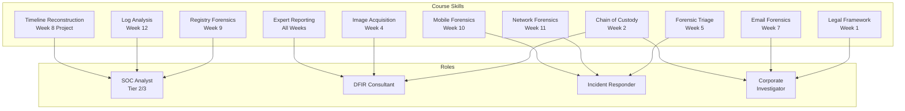

# Learning Reflection — IT Security Forensics (CSC-7310)

Ross Moravec · Postgraduate Cybersecurity Certificate, Cambrian College · Winter 2025

---

## Why This Course Mattered

Forensics is the discipline that tells you **what actually happened**. Firewalls, IDS, SIEMs all answer "what *might* be happening?" — forensics answers "what did happen, on this machine, at this time, because of this user action?"

For someone moving from infrastructure/ops into security, this course was a deliberate inflection point: it's where operational knowledge (file systems, Windows internals, logs) becomes **investigative capability**.

---

## What I Built Mental Models For

### 1. Evidence as a Legal Object

Before this course, "evidence" was a fuzzy concept. After it, evidence has a lifecycle: **seized → sealed → imaged → verified → analyzed → reported → produced**. Each transition has documentation requirements. Each documentation failure can break the chain and void the work. This is discipline I can take into any security role — even if I never testify in court, the rigor of chain-of-custody thinking prevents contamination and self-deception in every investigation.

### 2. The Registry as a Behavior Log

Windows Registry used to mean "that thing regedit opens." Now it's the **most reliable behavior log** on a Windows machine. USB history, app launches, folder browsing, Wi-Fi networks, recently-opened documents — all there, all persistent, all timestamped. Every SOC analyst and DFIR consultant needs this model.

### 3. File Systems as Intentional Maps

FAT, NTFS, ext — each records user actions in slightly different ways. NTFS's MFT + $I30 + ADS all tell different parts of the story. Knowing that deleted files aren't gone (they're unallocated), knowing that slack space holds prior file contents, knowing that the $Recycle.Bin keeps metadata separate from data — these are the primitives of real forensic work.

### 4. Timelines as the Deliverable

Individual artifacts are not the deliverable. The **unified timeline** — Event Log correlated with Registry activity correlated with file system changes correlated with network activity — is the deliverable. A case is a story, and the timeline is the story's structure.

---

## What I Struggled With

### Transcription Quality

The course was delivered synchronously online with real-time transcription. The transcripts are noisy (e.g., "FBHAI" for "FBI", "Lalters" for "alters"). This forced me to listen critically rather than rely on transcripts, and to cross-reference terminology with NDG lab PDFs and external sources. A hidden benefit: I learned the vocabulary actively rather than passively.

### Tool Access Friction

NDG virtual labs are browser-based and provide a shared forensic workstation. This is great for legal/safety reasons (no live case data), but creates friction for experimentation. I learned to plan each session — know the artifacts I'm after before launching the lab — rather than exploring aimlessly.

### Balancing Depth and Breadth

A 12-week forensics course covers an enormous surface area. I had to make choices: depth on registry + logs (because they're immediately relevant to SOC work), breadth on mobile + steganography (because I needed vocabulary more than expertise). This prioritization itself is a career skill.

---

## How This Course Maps to Employment Roles

### SOC Analyst (Tier 2/3)

- **Registry forensics (Week 9)** — triage alerts by pulling user-activity artifacts from the suspect machine's registry.
- **Log analysis (Week 12)** — this is 60% of a SOC analyst's day-to-day work.
- **Timeline reconstruction (Week 8 project)** — central to escalating incidents from Tier 1 to Tier 3.

### DFIR Consultant

- **Chain of custody (Week 2)** — non-negotiable for any investigation that might lead to litigation or HR action.
- **Image acquisition (Week 4)** — client engagements start with "preserve this evidence" before any analysis.
- **Expert reporting (all weeks)** — what clients pay for is the report, not the investigation.

### Incident Responder

- **Forensic triage (Week 5)** — on-scene decisions under pressure.
- **Network forensics (Week 11)** — packet capture analysis during active containment.
- **Mobile forensics (Week 10)** — phishing victims often need phone examination.

### Corporate Internal Investigator

- **Legal framework (Week 1)** — Section 8 scope for employer searches (much narrower than warrants).
- **Email forensics (Week 7)** — harassment and policy-violation cases live here.
- **Chain of custody (Week 2)** — HR/legal-facing investigations must survive grievance arbitration.

---

## Specific Skills I'd Claim in a Job Interview

1. "I can build a forensic image with FTK Imager, verify its integrity with MD5/SHA-256, and maintain chain-of-custody documentation from seizure through report."
2. "I can extract Windows Registry hives and parse them for user activity — ShellBags, UserAssist, USBSTOR, RecentDocs — using Registry Explorer and RegRipper."
3. "I can parse `$Recycle.Bin` `$I`/`$R` files to recover deleted files and their deletion timestamps."
4. "I can correlate Windows Event Log entries (4624, 4625, 4672, 4688, 4720, 1102) with registry activity and file-system changes to reconstruct a unified timeline."
5. "I can write an expert report that a judge, HR director, or non-technical executive can follow — facts → evidence → conclusion, with timestamped citations."

---

## Connection to Other Courses in the Program

| Course | Connection Point |
|---|---|
| **400 Fundamentals of IT** | File systems, Windows internals — foundational substrate for forensic analysis |
| **401 CSEC Infrastructure** | Network architecture understanding enables network forensics (Week 11) |
| **402 Business Continuity** | IR plan ↔ forensic evidence-handling procedures |
| **403 Policies & Compliance** | Chain-of-custody requirements match ISO 27037, ACPO guidelines |
| **404 Communications for Cybersecurity** | Expert report writing ↔ professional communication skills |
| **405 Mobile & Wireless Security** | Mobile forensics (Week 10) ↔ mobile security fundamentals |
| **406 SysOps & Cloud Security** | Cloud forensics (not covered here) is the gap — needs separate study |
| **407 Tool Development** | Custom forensic script authoring ↔ Python/PowerShell tool-building skills |
| **409 Ethical Hacking** | Attacker artifacts seen from the defender's side |
| **410 Malware Analysis** | Malware forensic artifacts — registry persistence, fileless malware traces |

---

## What I'd Do Differently

1. **Invest more in Autopsy / Sleuth Kit hands-on.** NDG labs are great for guided work, but real forensic analysts live in Autopsy or X-Ways. I'd install Autopsy locally and work through sample cases.
2. **Build a home lab for Volatility memory analysis.** Memory forensics was covered conceptually but not in depth; it's a critical skill I need to add.
3. **Practice expert-report writing more.** The report is the deliverable. I'd seek out real anonymized case studies and practice writing reports from the evidence outward.
4. **Learn YARA rules.** For classification and pattern-matching — essential for scaling forensic analysis.

---

## Career Next Steps

- **Short term** (next 3 months): Complete Autopsy certification (free), practice 3 publicly-available CTF forensic challenges.
- **Medium term** (6–12 months): GCFE (GIAC Certified Forensic Examiner) or CHFI (EC-Council CHFI) — whichever aligns with target employers.
- **Long term** (1–3 years): GCFA (GIAC Certified Forensic Analyst) or CCFP (Certified Cyber Forensics Professional) as career-progression credentials.

---

## Acknowledgment

Thanks to **Dr. Maryam Ahmed** for structuring the course around the **investigation lifecycle** rather than tool-feature-by-tool-feature. That pedagogical choice — legal → custody → imaging → analysis → correlation → report — is what made the skills transferable.

---

## Related

- **[Course README](README.md)** — course overview and navigation
- **[Lab Index](assignments/README.md)** — per-lab methodology and findings
- **[Final Project](FINAL_PROJECT_FORENSIC_INVESTIGATION.md)** — integrated investigation
- **[Weekly Summary](WEEKLY_SUMMARY.md)** — lecture-by-lecture topics
