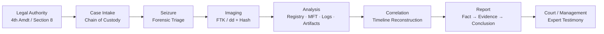

# IT Security Forensics — CSC-7310

> **Course portfolio** — Postgraduate Cybersecurity Certificate, Cambrian College (Winter 2025).
> Instructor: **Dr. Maryam Ahmed**. Student: Ross Moravec (A00322717).
> 11 weeks of instruction · 7 completed labs · 1 major investigation project.

---

## About Me

Ross Moravec — cybersecurity postgraduate candidate with a background in IT infrastructure and a focus on digital forensics and incident response. This portfolio documents hands-on forensic investigation skills developed through Cambrian College's Cybersecurity Certificate program (Winter 2025), including evidence handling, Windows artifact analysis, scripting automation, and expert report writing.

📧 [rossmoravec@email.com](mailto:rossmoravec@email.com) · 🔗 [LinkedIn](https://linkedin.com/in/rossmoravec) · 💻 [GitHub](https://github.com/RossMora-Pilots)

---

## What I'm Looking For

**Target role:** Junior DFIR Analyst, SOC Analyst (Tier 2), or Corporate IT Investigator — ideally in an environment where I can apply Windows forensic skills while growing into memory forensics and incident response. Available immediately upon program completion (April 2025).

---

## 🚀 Quick Start for Hiring Managers

| Time Budget | What to Read |
|---|---|
| **5 minutes** | [Key Achievements](#-key-achievements) below + browse the [Lab Index](assignments/README.md) |
| **15 minutes** | [Final Project write-up](FINAL_PROJECT_FORENSIC_INVESTIGATION.md) + skim [Weeks 1–12 summaries](WEEKLY_SUMMARY.md) |
| **30 minutes** | Open three labs: [Lab 21 Chain of Custody](assignments/README.md#lab-21--chain-of-custody-week-2) (procedural rigor) · [Lab 04 Registry](assignments/README.md#lab-04--windows-registry-forensics-week-9) (technical depth) · [Lab 17 Log Analysis](assignments/README.md#lab-17--log-capturing-and-interpretation-week-12) (timeline reconstruction) |
| **60 minutes** | [Learning Reflection](LEARNING_REFLECTION.md) — how this course maps to **SOC Analyst**, **DFIR Consultant**, and **Incident Responder** roles |

---

## 🎯 Key Achievements

**Quantified Results:**

| Outcome | Detail |
|---|---|
| Investigation lifecycle mastered | Legal authority → intake → imaging → analysis → reporting |
| Labs completed (NDG Forensics v2) | **7 of 7** — Chain of Custody, Imaging, Steganography, Recycle Bin, Registry, Mobile, Log Analysis |
| Major projects delivered | **1** — multi-phase Windows forensic investigation (Week 8) |
| Hands-on tools | FTK Imager 4.7.3 (Exterro), Magnet AXIOM, Autopsy/Sleuth Kit (via NDG) |
| File systems analyzed | FAT16, FAT32, NTFS, ext3, ext4 |
| Windows hives examined | SAM, SYSTEM, SOFTWARE, NTUSER.DAT, UsrClass.dat |
| Email protocols parsed | SMTP, POP3, IMAP, MAPI |
| Mobile platforms acquired | iOS and Android (logical + file system extraction) |
| Network captures analyzed | TCP/UDP packet reconstruction (Week 11) |

**Signature Capabilities:**

1. **Build a legally-defensible forensic image** — write-blocked acquisition, MD5/SHA-256 hash chain, contemporaneous notes, packaging and custody transfer logs.
2. **Extract artifacts from Windows registry hives** — user activity tracking (ShellBags, UserAssist, RecentDocs), installed applications, network connections (MRU lists), USB device history.
3. **Recover deleted evidence** — Recycle Bin $I/$R parsing, NTFS file slack, Master File Table (MFT) entry carving, unallocated cluster analysis.
4. **Reconstruct timelines from heterogeneous logs** — cross-correlate Windows Event Logs, application logs, syslog, and packet captures into a single defensible narrative.
5. **Write expert reports** — structure findings as fact → evidence → interpretation → conclusion, suitable for civil, criminal, or administrative proceedings.

---

## 📚 Course Content at a Glance

| Week | Date | Topic | Deliverable |
|---|---|---|---|
| 1 | Jan 9 | Introduction, Legal Framework (4th Amendment, Section 8) | — |
| 2 | Jan 16 | Chain of Custody, Lab Certification (ASCLD) | [Lab 21 ✓](assignments/README.md#lab-21--chain-of-custody-week-2) |
| 3 | Jan 23 | *(No class held)* | — |
| 4 | Jan 30 | Forensic Lab Setup, Workstation Specs, Image Creation | [Lab 01 ✓](assignments/README.md#lab-01--creating-a-forensic-image-week-4) |
| 5 | Feb 6 | Forensic Triage, Live Data Acquisition, Tools Overview | — |
| 6 | Feb 13 | File Systems (FAT, NTFS, ext3/4), Steganography | [Lab 10 ✓](assignments/README.md#lab-10--steganography-week-6) |
| 7 | Feb 20 | Email Forensics, Recycle Bin Forensics | [Lab 09 ✓](assignments/README.md#lab-09--recycle-bin-forensics-week-7) |
| 8 | Mar 6 | Windows Forensics, Volatile Data, Swap, Event Logs | **[Project 1 ✓](FINAL_PROJECT_FORENSIC_INVESTIGATION.md)** |
| 9 | Mar 15 | Windows Registry Deep-Dive | [Lab 04 ✓](assignments/README.md#lab-04--windows-registry-forensics-week-9) |
| 10 | Mar 19 | Mobile Forensics (iOS/Android) | [Lab 16 ✓](assignments/README.md#lab-16--mobile-forensics-week-10) |
| 11 | Mar 27 | Network Forensics, Packet Analysis, Incident Response | — |
| 12 | Mar 31 | Log Capturing & Interpretation (Final) | [Lab 17 ✓](assignments/README.md#lab-17--log-capturing-and-interpretation-week-12) |

Full narrative: **[WEEKLY_SUMMARY.md](WEEKLY_SUMMARY.md)**

---

## 📁 Navigation

- **Labs (7)** → [`assignments/`](assignments/) — NDG instruction PDFs paired with student submission DOCX files
- **Final Project** → [FINAL_PROJECT_FORENSIC_INVESTIGATION.md](FINAL_PROJECT_FORENSIC_INVESTIGATION.md) — Week 8 multi-phase investigation
- **Weekly topic summaries** → [WEEKLY_SUMMARY.md](WEEKLY_SUMMARY.md) — Every lecture synthesized
- **Screenshots** → [`screenshots/`](screenshots/) + [EVIDENCE_INDEX.md](EVIDENCE_INDEX.md)
- **Scripts** → [`scripts/`](scripts/) + [SCRIPTS_README.md](SCRIPTS_README.md)
- **Transcripts** → [`transcripts/`](transcripts/) — 8 lecture transcripts (plain text)
- **Learning Reflection** → [LEARNING_REFLECTION.md](LEARNING_REFLECTION.md) — Course → career mapping

---

## 🛠️ Skills Matrix

**Technical Forensics:**

- Chain-of-custody documentation (intake forms, evidence bags, transfer logs)
- Forensic image acquisition (FTK Imager, dd, write-blockers, hash verification)
- File system analysis — FAT16/32, NTFS (MFT, $I30, ADS), ext3/ext4
- Windows Registry analysis — SAM, SYSTEM, SOFTWARE, NTUSER.DAT hives
- Recycle Bin forensics — $Recycle.Bin, $I/$R files
- Steganography detection — LSB, EOF, header injection analysis
- Email forensics — header analysis, spoofing detection, MAPI/IMAP artifacts
- Mobile forensics — iOS/Android acquisition, SQLite artifact extraction
- Network forensics — PCAP analysis, TCP/UDP reconstruction
- Log analysis — Windows Event Logs, Syslog, Apache access logs, timeline reconstruction

**Legal & Professional:**

- 4th Amendment (US) / Section 8 (Canada) search and seizure framework
- Search warrant scope and admissibility of evidence
- ASCLD-Lab / ISO 17025 certification requirements
- Civil, criminal, and administrative case handling
- Expert witness report writing

**Tools (hands-on via NDG virtual labs):**

- **Exterro FTK Imager 4.7.3** — acquisition, verification, logical export
- **Magnet AXIOM** — multi-platform artifact carving
- **Autopsy / Sleuth Kit** — file-system carving (NDG labs)
- **Volatility Framework** — memory analysis (lecture content)
- **Wireshark** — PCAP analysis (Week 11)

---

## 🔍 Investigation Workflow (Learned in This Course)

Each NDG lab in this portfolio exercises one or more stages of this pipeline. See [WEEKLY_SUMMARY.md](WEEKLY_SUMMARY.md) for the pedagogical arc.

---

## 📝 Naming Conventions (this course)

- **Folder:** `CC/Winter 2025/IT Security Forensics - Maryam Ahmed - CSC-7310`
- **Labs:** `assignments/Lab-NN-<Topic>-{NDG-Instructions|Submission}.{pdf|docx}`
- **Transcripts:** `transcripts/week-NN-YYYY-MM-DD-transcript.txt`
- **Screenshots:** `screenshots/wkNN_<topic>_<index>.png`
- **Scripts:** student-authored in `scripts/`; external/reference in `scripts-extra/`

---

## 🔗 References

- [NDG Forensics v2 Curriculum](https://www.netdevgroup.com/online/labs/nisgtc-forensics/) — lab source curriculum
- [Exterro FTK Imager 4.7.3](https://www.exterro.com/ftk-product-downloads/ftk-imager-4-7-3-81) — imaging tool used in labs
- [Magnet AXIOM](https://www.magnetforensics.com/products/magnet-axiom/) — multi-platform forensic suite
- [Cambrian College Cybersecurity Certificate](https://cambriancollege.ca/programs/cybersecurity/) — program home
