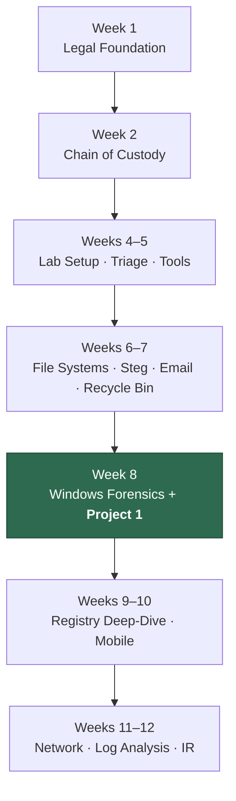

# Weekly Summary — IT Security Forensics (CSC-7310)

Winter 2025 · Dr. Maryam Ahmed · 11 weeks of instruction (Week 3 cancelled).

Each week's summary below synthesizes the lecture transcript, NDG lab, and any submitted deliverable. Raw transcripts live in [`transcripts/`](transcripts/).

---

## Week 1 — Introduction & Legal Framework

**Date:** January 9, 2025 · **Transcript:** [`week-01-2025-01-09-transcript.txt`](transcripts/week-01-2025-01-09-transcript.txt) (51 KB)

**Topics:**

- Definition of digital forensics: obtaining and analyzing digital information for civil, criminal, or administrative cases.
- **FBI CART** (Computer Analysis Response Team) — formed 1984 to handle digital evidence.
- **RCMP NC3** (National Cybercrime Coordination Unit) — Canadian counterpart.
- **4th Amendment** (U.S. Constitution) — protection from unreasonable search and seizure; requires warrants specifying scope.
- **Section 8** (Canadian Charter of Rights and Freedoms) — equivalent protection; searches must be "reasonable in the circumstances."
- Why search warrants matter to forensic examiners: **evidence obtained without proper authority is inadmissible**.
- Categories of forensic work: computer forensics, network forensics, data recovery, disaster recovery.
- Professional conduct expectations: impartiality, documentation, continuing education.

**Deliverable:** None (no lab this week — introductory lecture).

**Key takeaway:** Forensics is a legal-technical discipline. The technical work is worthless if the legal process is flawed.

---

## Week 2 — Chain of Custody & Lab Certification

**Date:** January 16, 2025 · **Transcript:** [`week-02-2025-01-16-transcript.txt`](transcripts/week-02-2025-01-16-transcript.txt) (54 KB)

**Topics:**

- Chain-of-custody procedures: every handoff documented, every access logged.
- **Company policy violations** as case types (alongside civil/criminal/admin).
- Forensic lab certification: **ASCLD-Lab** (American Society of Crime Laboratory Directors), ISO 17025.
- Workstation specifications for forensic analysis.
- Lab manager vs. lab staff responsibilities.
- Evidence intake protocols, sealed packaging, locker storage with access logs.

**Deliverable:** [Lab 21 — Chain of Custody](assignments/README.md#lab-21--chain-of-custody-week-2)

**Key takeaway:** Custody is a discipline. A single broken link (undocumented transfer) can invalidate the entire case.

---

## Week 3 — *(No class held)*

No lecture or lab this week.

---

## Week 4 — Forensic Lab Setup & Image Creation

**Date:** January 30, 2025 · **Transcript:** [`week-04-2025-01-30-transcript.txt`](transcripts/week-04-2025-01-30-transcript.txt) (64 KB)

**Topics:**

- Forensic workstation selection criteria: CPU, RAM (minimum 16 GB, 32 GB+ preferred), storage, write-blocker support.
- Business case for building a forensic lab (cost, staffing, certification).
- ASCLD-Lab accreditation process.
- Forensic image creation fundamentals: bit-for-bit vs. file-level copies.
- Image formats: raw `dd`, EnCase `E01`, AFF (Advanced Forensic Format).
- Hash-verification chain — pre-image read, post-image verification.

**Deliverable:** [Lab 01 — Creating a Forensic Image](assignments/README.md#lab-01--creating-a-forensic-image-week-4)

**Key takeaway:** A forensic image is evidence. Format and verification matter more than speed.

---

## Week 5 — Forensic Triage & Tools

**Date:** February 6, 2025 · **Transcript:** [`week-05-2025-02-06-transcript.txt`](transcripts/week-05-2025-02-06-transcript.txt) (37 KB)

**Topics:**

- **Forensic triage** (on-site assessment): what to image, what to leave, what to document.
- Evidence collection and seizure procedures: bagging, labeling, transport.
- System shutdown procedures: **live acquisition** (preserve RAM) vs. pull-the-plug (preserve disk state).
- Live connections and running process monitoring.
- Framework for proper forensic procedure: plan → acquire → verify → analyze → report.

**Tools introduced:**

- [FTK Imager 4.7.3 (Exterro)](https://www.exterro.com/ftk-product-downloads/ftk-imager-4-7-3-81)
- [Magnet AXIOM (Magnet Forensics)](https://www.magnetforensics.com/products/magnet-axiom/)

**Deliverable:** None (reference week).

**Key takeaway:** On-scene decisions are irreversible. Triage is the art of knowing what to preserve.

---

## Week 6 — File Systems & Steganography

**Date:** February 13, 2025 · **Transcript:** [`week-06-2025-02-13-transcript.txt`](transcripts/week-06-2025-02-13-transcript.txt) (20 KB)

**Topics:**

- **Windows file systems:** FAT16, FAT32, NTFS.
- **Linux file systems:** ext3, ext4.
- File storage mechanics: clusters, blocks, inodes.
- Hard links vs. soft (symbolic) links.
- Slack space, unallocated clusters — where deleted data hides.
- **Steganography** techniques: LSB substitution, EOF appending, header injection, metadata embedding.
- Detection strategies: file size anomalies, known-clean hash comparison, specialized tools.

**Deliverable:** [Lab 10 — Steganography](assignments/README.md#lab-10--steganography-week-6)

**Key takeaway:** The file system is a map of intent — folders, deletes, renames, copies all leave traces.

---

## Week 7 — Email & Recycle Bin Forensics

**Date:** February 20, 2025 · **Transcript:** [`week-07-2025-02-20-transcript.txt`](transcripts/week-07-2025-02-20-transcript.txt) (38 KB)

**Topics:**

- **Email protocols:** SMTP, POP3, IMAP, MAPI — forensic artifacts each leaves.
- Email header analysis: Received headers as source-IP trail, X-Mailer, Message-ID uniqueness.
- Sender/recipient identification from headers.
- Attachment analysis, MIME parsing.
- **Email spoofing detection** (SPF, DKIM, DMARC checks; header vs. envelope mismatch).
- **Recycle Bin forensics:** `$Recycle.Bin\<SID>\` structure, `$I` metadata, `$R` content.

**Deliverable:** [Lab 09 — Recycle Bin Forensics](assignments/README.md#lab-09--recycle-bin-forensics-week-7)

**Key takeaway:** Email headers are forensically rich — the visible `From:` is often the least trustworthy field.

---

## Week 8 — Windows Forensics & Major Project

**Date:** March 6, 2025 · **Transcript:** [`week-08-2025-03-06-transcript.txt`](transcripts/week-08-2025-03-06-transcript.txt) (46 KB)

**Topics:**

- Windows OS evolution: Windows 3.0 → Windows 11.
- File system choices across Windows versions (FAT → NTFS).
- Windows 10/11 features relevant to forensics: Cortana artifacts, Edge history, Universal Search.
- **Volatile data:** RAM, running processes, open handles, network connections.
- **Swap file (pagefile.sys)** as forensic source.
- Windows event logs — forensic importance.
- **Windows Registry structure** — hives and their locations.

**Deliverable:** **[Final Project 1 — Windows Forensic Investigation](FINAL_PROJECT_FORENSIC_INVESTIGATION.md)**

**Key takeaway:** Windows is a forensics treasure map — every user action leaves registry, log, and file-system traces.

---

## Week 9 — Windows Registry Deep-Dive

**Date:** March 15, 2025 (no lecture; continuation of Week 8)

**Topics:**

- Registry hive locations and extraction from a forensic image.
- Key-value structure, data types (REG_SZ, REG_BINARY, REG_DWORD, etc.).
- User-activity artifacts:
  - **ShellBags** — folder-browsing history
  - **UserAssist** — GUI app launches (ROT-13 encoded)
  - **RecentDocs** — recently-opened documents
  - **RunMRU** — Run dialog history
  - **TypedURLs** — IE/Edge address-bar history
- System artifacts:
  - **USBSTOR** — every USB device ever connected
  - **NetworkList** — Wi-Fi SSIDs
  - **Run / RunOnce** — persistence mechanisms
- Recovery of deleted registry entries from unallocated hive space.

**Deliverable:** [Lab 04 — Windows Registry Forensics](assignments/README.md#lab-04--windows-registry-forensics-week-9)

**Key takeaway:** The registry answers "who was here, what did they do, and when" — more reliably than most other artifact sources.

---

## Week 10 — Mobile Forensics

**Date:** March 19, 2025 (asynchronous — lab only)

**Topics:**

- Mobile device acquisition methods: logical, file-system, physical (chip-off, JTAG).
- **iOS acquisition** — iTunes backups, iCloud, jailbreak-enabled extraction.
- **Android acquisition** — ADB backup, rooted filesystem extraction, EDL mode.
- App-layer artifacts: messaging apps (WhatsApp, Signal), browser history, location data.
- SQLite database parsing; WAL (write-ahead log) as deleted-data source.
- **Legal complexity** — mobile searches often require a separate warrant.

**Deliverable:** [Lab 16 — Mobile Forensics](assignments/README.md#lab-16--mobile-forensics-week-10)

**Key takeaway:** Mobile devices hold more personal data than any other modern artifact source — treat accordingly.

---

## Week 11 — Network Forensics & Incident Response

**Date:** March 27, 2025 · **Transcript:** [`week-11-2025-03-27-transcript.txt`](transcripts/week-11-2025-03-27-transcript.txt) (75 KB)

**Topics:**

- Network packet fundamentals: layer 2 → 3 → 4 → 7.
- **TCP vs. UDP** packet structure and forensic artifacts of each.
- PCAP analysis workflow: capture → filter → reconstruct → interpret.
- Firewall forensics — rule hits, drops, NAT translations.
- Intrusion detection artifacts — IDS/IPS alerts, suricata/snort rules.
- **Incident response phases** (per NIST SP 800-61): Preparation → Identification → Containment → Eradication → Recovery → Lessons Learned.
- Network capture as evidence — admissibility, chain-of-custody for PCAPs.

**Deliverable:** None (lecture week).

**Key takeaway:** Network evidence dies fast. If you didn't capture it while it was happening, it's often gone forever.

---

## Week 12 — Log Analysis & Incident Response (Final)

**Date:** March 31, 2025 (asynchronous — lab only)

**Topics:**

- System log sources: Windows Event Logs, Syslog (Linux/Unix), application logs (Apache, IIS), security appliance logs.
- Log parsing and normalization — getting everything into a single timestamp-sortable format.
- **Timeline analysis** from heterogeneous logs.
- Incident-response workflow integration.
- Evidence correlation across sources.
- **Final report generation** — structure, tone, audience.

**Deliverable:** [Lab 17 — Log Capturing and Interpretation](assignments/README.md#lab-17--log-capturing-and-interpretation-week-12)

**Key takeaway:** Timeline reconstruction is the capstone skill — where everything the course taught comes together.

---

## Pedagogical Arc

The course follows a deliberate progression:

The project is positioned at Week 8 (not Week 12) because **integration is the teacher** — only by running a complete case can students realize what they don't yet know, creating receptivity for Weeks 9–12's deeper technical content.

---

## Related

- **[Lab Index](assignments/README.md)** — per-lab methodology, findings, tools
- **[Final Project](FINAL_PROJECT_FORENSIC_INVESTIGATION.md)** — the integrating deliverable
- **[Learning Reflection](LEARNING_REFLECTION.md)** — how this course maps to DFIR/SOC/IR employment
