# Lab Index — IT Security Forensics (CSC-7310)

Seven NDG Forensics v2 labs completed over Winter 2025. Each lab pairs:

- **NDG Instructions** (PDF) — the lab curriculum from Network Development Group
- **Submission** (DOCX) — the student's completed lab write-up with screenshots, answers, and analysis

| # | Lab | Week | Topic | Lab PDF | Submission |
|---|---|---|---|---|---|
| 1 | Lab 21 | Week 2 | Chain of Custody | [PDF](Lab-21-Chain-of-Custody-NDG-Instructions.pdf) | [DOCX](Lab-21-Chain-of-Custody-Submission.docx) |
| 2 | Lab 01 | Week 4 | Creating a Forensic Image | [PDF](Lab-01-Creating-Forensic-Image-NDG-Instructions.pdf) | [DOCX](Lab-01-Creating-Forensic-Image-Submission.docx) |
| 3 | Lab 10 | Week 6 | Steganography | [PDF](Lab-10-Steganography-NDG-Instructions.pdf) | [DOCX](Lab-10-Steganography-Submission.docx) |
| 4 | Lab 09 | Week 7 | Recycle Bin Forensics | [PDF](Lab-09-Recycle-Bin-Forensics-NDG-Instructions.pdf) | [DOCX](Lab-09-Recycle-Bin-Forensics-Submission.docx) |
| 5 | Lab 04 | Week 9 | Windows Registry Forensics | [PDF](Lab-04-Registry-Forensics-NDG-Instructions.pdf) | [DOCX](Lab-04-Registry-Forensics-Submission.docx) |
| 6 | Lab 16 | Week 10 | Mobile Forensics | [PDF](Lab-16-Mobile-Forensics-NDG-Instructions.pdf) | [DOCX](Lab-16-Mobile-Forensics-Submission.docx) |
| 7 | Lab 17 | Week 12 | Log Capturing & Interpretation | [PDF](Lab-17-Log-Capturing-NDG-Instructions.pdf) | [DOCX](Lab-17-Log-Capturing-Submission.docx) |

> **Note on DOCX files:** Student submissions are retained as DOCX via Git LFS. Convert to PDF via the optional `docx-to-pdf` workflow for viewing directly on GitHub.

---

## Lab 21 — Chain of Custody (Week 2)

**Objective:** Demonstrate the complete lifecycle of evidence custody from first response through courtroom admissibility. Document every transfer, every access, every handoff in accordance with ASCLD-Lab standards.

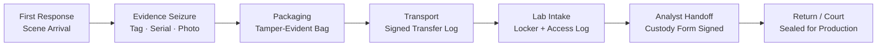

**Key Evidence:**

**Methodology:**

1. Simulated intake of a seized workstation from a company policy violation.
2. Completed chain-of-custody form (evidence tag, serial, hash values, seal number, intake officer).
3. Documented every subsequent handoff (analyst receipt, locker storage, return-to-requester).
4. Sealed evidence and verified tamper-evident packaging.

**Key Findings / Outputs:**

- A fully-populated chain-of-custody document with signatures at every transfer.
- Evidence-bag seal verification log.
- Understanding that a **broken custody chain = inadmissible evidence** regardless of technical merit of the forensic work.

**Tools:** Pen-and-paper forms (simulated), evidence tags, tamper-evident bags, locker with access log.

**Lessons Learned:**

- Custody is as much a legal/procedural discipline as a technical one.
- Every person touching evidence must be documented — including the analyst who does the imaging.
- Lab certification (ASCLD-Lab, ISO 17025) exists to enforce these procedures uniformly across practitioners.

**Connects to:** Week 1 (legal authority — search warrants must specify scope), Project 1 (case intake + custody).

---

## Lab 01 — Creating a Forensic Image (Week 4)

**Objective:** Acquire a bit-for-bit forensic image from a target drive using FTK Imager, verify integrity via hashing, and preserve the original evidence unaltered.

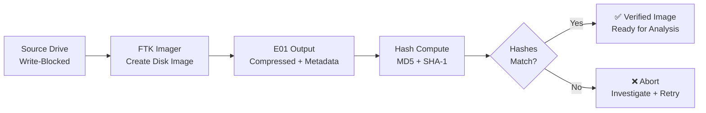

**Key Evidence:**

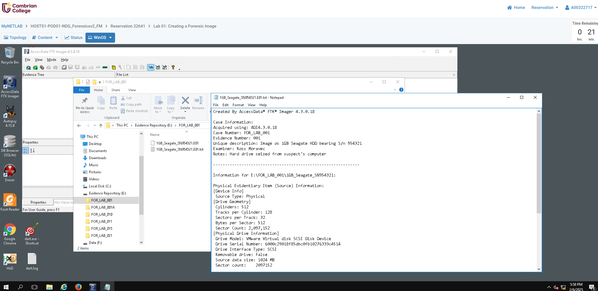

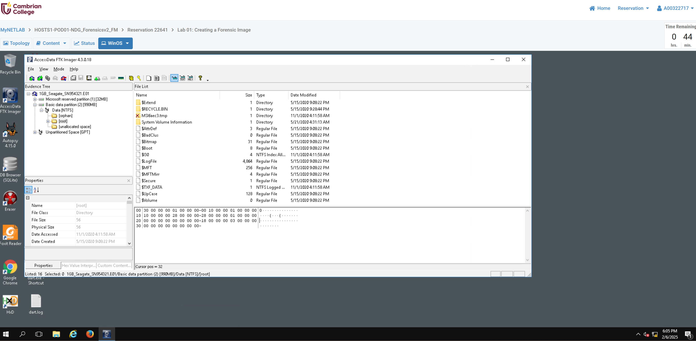

**Methodology:**

1. Attach source drive to a write-blocker (hardware or software).
2. Launch FTK Imager 4.7.3 → *Create Disk Image* → Physical Drive.
3. Select output format: **E01** (EnCase) with compression, or **dd** raw.
4. Configure case metadata (case number, evidence tag, examiner, notes).
5. Execute acquisition; FTK computes MD5 + SHA-1 during read.
6. Verify the post-image hash matches the pre-image read hash.

**Key Findings / Outputs:**

- A verified E01 forensic image with embedded hash values.
- FTK Imager acquisition log documenting start time, duration, and hash verification.
- Demonstrated that verification hashes (pre vs. post) matching is the **proof of evidence integrity**.

**Tools:** Exterro FTK Imager 4.7.3, write-blocker (simulated via NDG virtual lab), Windows forensic workstation.

**Lessons Learned:**

- E01 format embeds metadata + segmented archive + hash inline — preferred over raw `dd` for forensic contexts requiring self-contained evidence packages.
- Always acquire to a **forensically sterile** destination (wiped and verified).
- A mismatch between pre-image and post-image hash = abort, investigate, retry.

**Connects to:** Week 5 (triage and on-scene acquisition), Project 1 (case evidence preservation).

---

## Lab 10 — Steganography (Week 6)

**Objective:** Detect and extract hidden payloads concealed within carrier files (images, audio, documents) using LSB-substitution, header-appending, and metadata-embedding techniques.

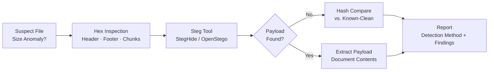

**Key Evidence:**

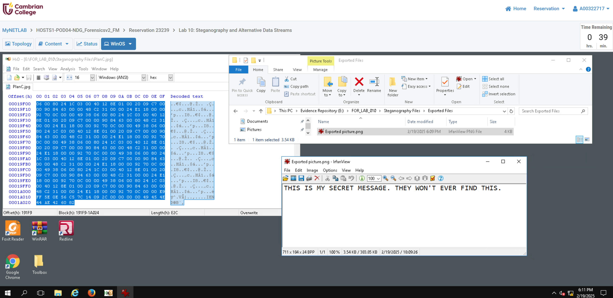

**Methodology:**

1. Examine suspected carrier files for size anomalies (file larger than expected for dimensions/format).
2. Use hex editor to inspect file headers, footers, and embedded chunks.
3. Use steganography tools (StegHide, OpenStego, or NDG-provided utility) to extract payloads.
4. Compare carrier file hashes against known-clean originals where available.
5. Document extracted payload and method of detection.

**Key Findings / Outputs:**

- Identified hidden text/file payloads concealed inside images.
- Recovered passphrases and content from steganographic containers.
- Produced analysis report showing detection method, extraction tool, and payload contents.

**Tools:** Hex editor (HxD / xxd), StegHide / OpenStego, file-type identification (`file` command, PE/JPEG header inspection).

**Lessons Learned:**

- Steganography is **easy to miss** without suspicion — size anomaly is often the first (only) clue.
- Modern forensic suites (AXIOM, Autopsy) include steganography detection modules but are not infallible.
- Passphrase recovery is often required — check for plaintext passphrase artifacts elsewhere in the case.

**Connects to:** Week 7 (email forensics — attachments as steg carriers), Project 1 (hidden evidence artifacts).

---

## Lab 09 — Recycle Bin Forensics (Week 7)

**Objective:** Recover deleted files from the Windows Recycle Bin (`$Recycle.Bin`), parse `$I` and `$R` metadata files, and reconstruct the deletion timeline.

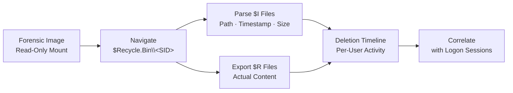

**Key Evidence:**

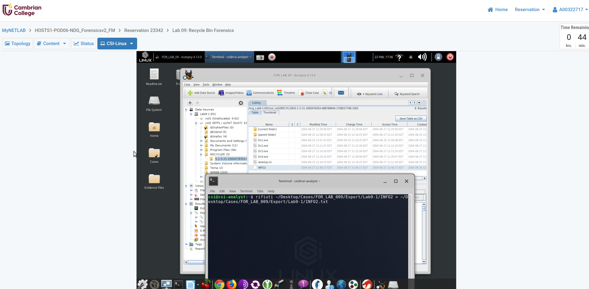

**Methodology:**

1. Mount the forensic image read-only.
2. Navigate to `C:\$Recycle.Bin\<SID>\` for each user account (SID from registry).
3. Enumerate `$I*` files (metadata: original path, deletion timestamp, file size).
4. Enumerate `$R*` files (the actual file content — still recoverable until emptied).
5. Parse `$I` files with forensic parser (e.g., `RBCmd.exe` by Eric Zimmerman).
6. Export recovered files and verify content.

**Key Findings / Outputs:**

- Table of deleted files: original path, deletion time, size, user SID, recoverable content.
- Reconstructed user's deletion activity timeline.
- Evidence that a user deleted specific incriminating files at identifiable timestamps.

**Tools:** FTK Imager (logical file export), RBCmd.exe, Windows SID resolution (`wmic useraccount get name,sid`).

**Lessons Learned:**

- Recycle Bin is a gold mine — users often assume delete = gone.
- `$I` format changed between Windows Vista and Windows 10+; parsers must support both.
- Empty Recycle Bin ≠ gone — file content may still be in unallocated clusters (see Week 9 registry + MFT).

**Connects to:** Week 9 (Registry — UserAssist shows what files user opened), Project 1 (timeline reconstruction).

---

## Lab 04 — Windows Registry Forensics (Week 9)

**Objective:** Extract and interpret forensic artifacts from Windows Registry hives to establish user activity, installed software, network history, and USB device connection history.

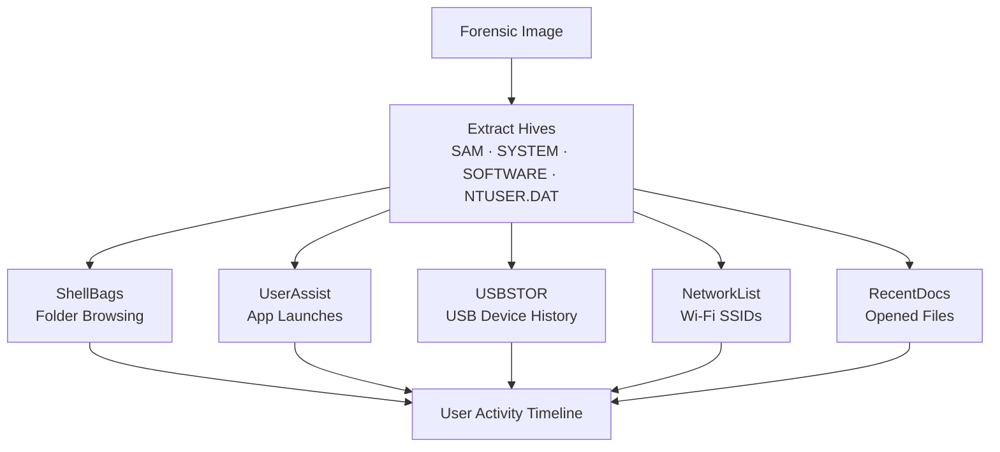

**Key Evidence:**

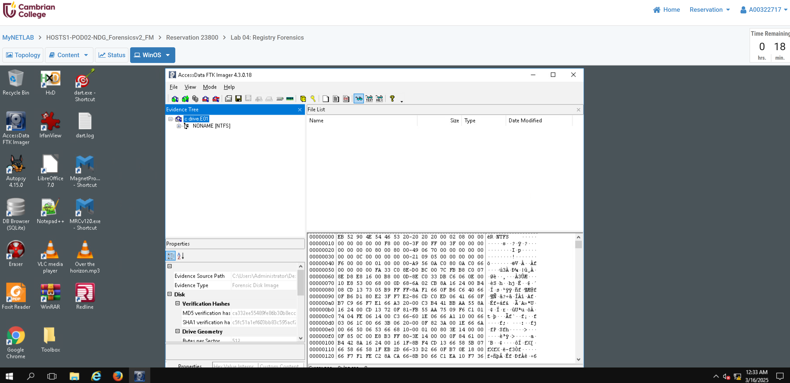

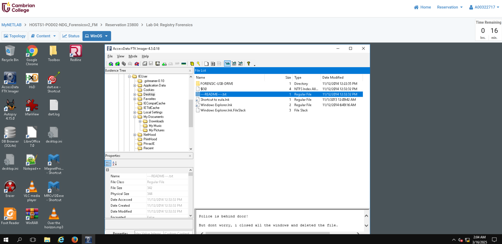

**Methodology:**

1. Extract registry hives from forensic image:
   - `%SystemRoot%\System32\config\SAM` (local accounts)
   - `%SystemRoot%\System32\config\SYSTEM` (devices, services, USB)
   - `%SystemRoot%\System32\config\SOFTWARE` (installed programs, run keys)
   - `C:\Users\<user>\NTUSER.DAT` (per-user activity)
   - `C:\Users\<user>\AppData\Local\Microsoft\Windows\UsrClass.dat` (shell activity)
2. Load hives in Registry Explorer / RegRipper.
3. Extract artifacts:
   - **ShellBags** (folders the user browsed)
   - **UserAssist** (GUI apps the user launched, with run counts and timestamps)
   - **RunMRU** (Win+R command history)
   - **RecentDocs** (recently-opened documents by extension)
   - **USBSTOR** (USB devices ever connected, serials, connection times)
   - **NetworkList** (Wi-Fi SSIDs connected to, timestamps)
4. Correlate findings into user-activity timeline.

**Key Findings / Outputs:**

- Complete USB device history including serial numbers and first/last connect times.
- User's folder browsing history (ShellBags).
- Evidence of specific applications launched with frequency and last-run times.
- Network SSIDs the machine connected to (establishing physical location history).

**Tools:** FTK Imager (hive extraction), Registry Explorer (Eric Zimmerman), RegRipper, RECmd.

**Lessons Learned:**

- Registry is the **second most important forensic source** after the MFT — it persists across reboots and records user intent.
- UserAssist keys are ROT-13 encoded (historical obfuscation, trivially reversed).
- USB history is definitive for answering "did this device ever connect to this machine?"
- Per-user hives (`NTUSER.DAT`) must be extracted from each user's profile separately.

**Connects to:** Week 7 (recycle bin deletion events tied to user SID), Week 12 (log analysis correlates registry activity with event logs).

---

## Lab 16 — Mobile Forensics (Week 10)

**Objective:** Perform forensic acquisition and analysis of a mobile device (iOS or Android), extract app data, and reconstruct user activity.

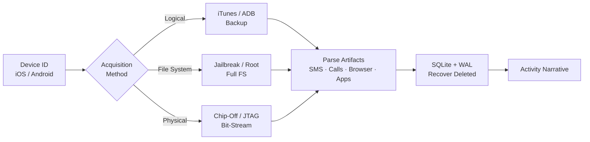

**Key Evidence:**

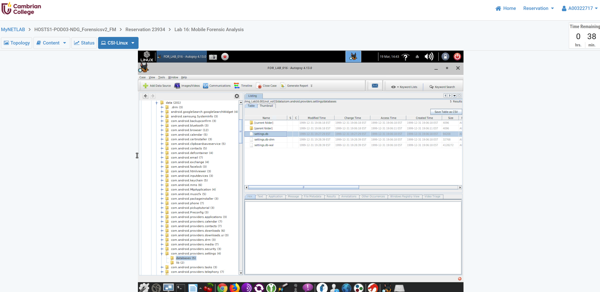

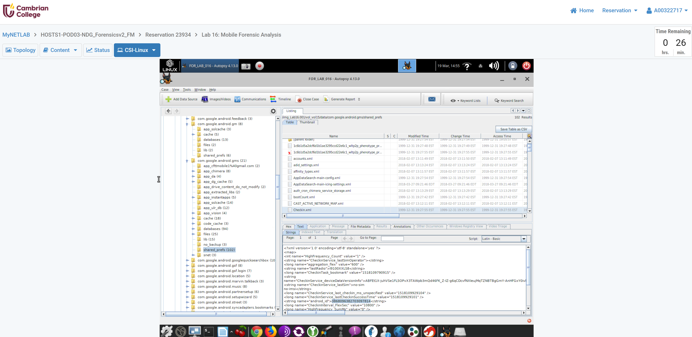

**Methodology:**

1. Identify device platform (iOS version / Android version).
2. Select acquisition method:
   - **Logical** (iTunes/ADB backup) — fastest, limited to user-visible data
   - **File system** (jailbreak/root required) — full filesystem access
   - **Physical** (chip-off, JTAG) — bit-stream of flash (destructive, specialized)
3. Extract backup / filesystem dump.
4. Parse common artifacts:
   - SMS/MMS databases (SQLite)
   - Call logs
   - Contacts
   - Browser history (Safari / Chrome)
   - App data (WhatsApp, Signal, Telegram)
   - Location history (GPS breadcrumbs in photos, Maps cache)
5. Correlate artifacts into user-activity narrative.

**Key Findings / Outputs:**

- Extracted SMS, call logs, contacts, browser history.
- Recovered deleted messages from SQLite WAL (write-ahead log) and free-list.
- Reconstructed device user's communication and browsing patterns.

**Tools:** NDG-provided mobile forensic environment; conceptual coverage of Cellebrite UFED, Magnet AXIOM Mobile, iTunes backup parser.

**Lessons Learned:**

- Mobile acquisition is **legally fraught** — often requires separate warrant from computer search.
- SQLite WAL files hold **uncommitted deletes** — check WAL before treating delete as permanent.
- iOS is more challenging than Android for non-jailbroken devices (encryption + sandboxing).
- App-layer artifacts (WhatsApp, Signal) are often more useful than OS-level artifacts.

**Connects to:** Project 1 (mobile device as evidence source), Week 4 (acquisition verification).

---

## Lab 17 — Log Capturing and Interpretation (Week 12)

**Objective:** Collect, parse, and correlate logs from multiple sources (Windows Event Logs, syslog, application logs) to reconstruct an incident timeline suitable for an expert report.

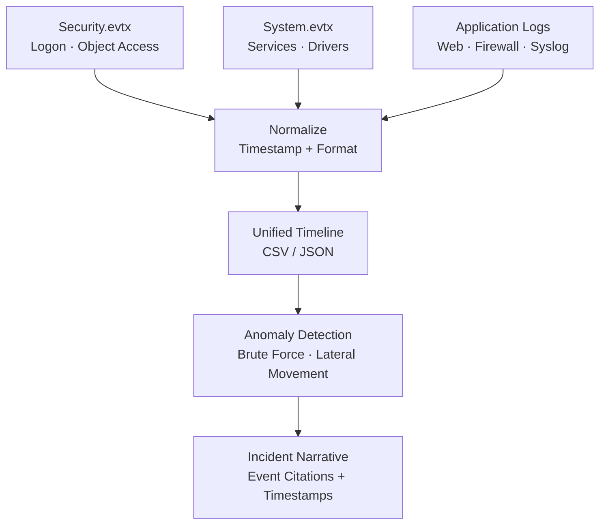

**Key Evidence:**

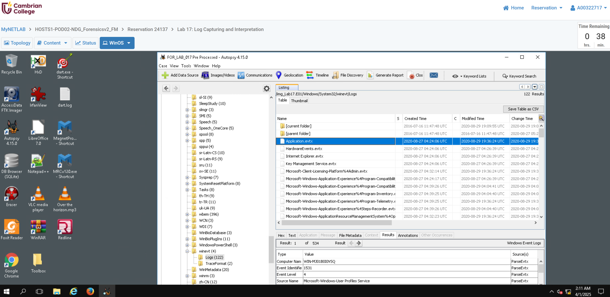

**Methodology:**

1. Collect Windows Event Logs (`%SystemRoot%\System32\winevt\Logs\*.evtx`):
   - **Security.evtx** (logon/logoff, object access)
   - **System.evtx** (services, drivers)
   - **Application.evtx** (app crashes, installs)
2. Collect syslog from Unix/Linux hosts (`/var/log/auth.log`, `/var/log/syslog`).
3. Collect application logs (web server access logs, firewall logs).
4. Parse into unified timeline (CSV / JSON).
5. Identify anomalies — impossible travel, failed logins, privilege escalations, unusual processes.
6. Write incident narrative with cited log events and timestamps.

**Key Findings / Outputs:**

- Unified timeline CSV with timestamped events from 3+ log sources.
- Identified specific attack indicators (brute-force attempts, lateral movement).
- Expert report with event citations (log source, event ID, timestamp, description).

**Tools:** Windows Event Viewer, `wevtutil`, Log Parser, grep/awk/sed, simple Python parsers.

**Lessons Learned:**

- **Timestamps are lies** until you've verified timezone, NTP sync, and clock drift across hosts.
- Event log IDs are the universal language — memorize the top 20 (4624, 4625, 4672, 4688, 4720, etc.).
- Log correlation across hosts is where incident response lives — single-host logs rarely tell the full story.
- Attackers clear logs — **log-clearing events** (1102 in Security, 104 in System) are themselves high-value indicators.

**Connects to:** Week 9 (registry activity correlates with Event Log entries), Week 11 (network log correlation with PCAP).

---

## Cross-Lab Skill Matrix

| Skill | Lab 21 | Lab 01 | Lab 10 | Lab 09 | Lab 04 | Lab 16 | Lab 17 |
|---|---|---|---|---|---|---|---|
| Chain of custody | ✅ |  |  |  |  |  |  |
| Hash verification |  | ✅ | ✅ | ✅ | ✅ | ✅ |  |
| Legal framework | ✅ | ✅ |  |  |  | ✅ |  |
| Forensic imaging |  | ✅ |  |  |  | ✅ |  |
| File carving |  |  | ✅ | ✅ |  |  |  |
| Artifact extraction |  |  | ✅ | ✅ | ✅ | ✅ |  |
| Timeline reconstruction |  |  |  | ✅ | ✅ | ✅ | ✅ |
| Expert reporting | ✅ | ✅ | ✅ | ✅ | ✅ | ✅ | ✅ |

All 7 labs culminate in **expert reporting** — because no forensic work matters if you can't defend it in writing.

---

## Related Portfolio Docs

- **[Weekly Summary](../WEEKLY_SUMMARY.md)** — lecture-level topic coverage
- **[Final Project](../FINAL_PROJECT_FORENSIC_INVESTIGATION.md)** — integrates skills from all 7 labs
- **[Learning Reflection](../LEARNING_REFLECTION.md)** — course → career role mapping
