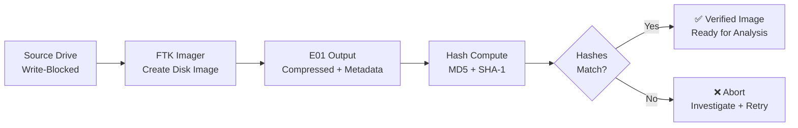

← [Back to Lab Index](README.md) | **Source:** [NDG Instructions (PDF)](Lab-01-Creating-Forensic-Image-NDG-Instructions.pdf) · [Submission (PDF)](pdf/Lab-01-Creating-Forensic-Image-Submission.pdf)

---

# Lab 01 — Creating a Forensic Image

**Week 4 — IT Security Forensics (CSC-7310)**

**Objective:** Acquire a bit-for-bit forensic image from a target drive using FTK Imager, verify integrity via hashing, and preserve the original evidence unaltered.

**Key Evidence:**

**Methodology:**

1. Attach source drive to a write-blocker (hardware or software).
2. Launch FTK Imager 4.7.3 → *Create Disk Image* → Physical Drive.
3. Select output format: **E01** (EnCase) with compression, or **dd** raw.
4. Configure case metadata (case number, evidence tag, examiner, notes).
5. Execute acquisition; FTK computes MD5 + SHA-1 during read.
6. Verify the post-image hash matches the pre-image read hash.

**Key Findings / Outputs:**

- Created verified E01 forensic image: `C Drive.E01` — output confirmed via FTK Imager Image Report.
- FTK Imager acquisition log documenting start time, duration, and hash verification.
- Post-acquisition hash match confirmed evidence integrity (MD5 + SHA-1 matched between pre-image read and post-image verification).

**Applicable Standards:** NIST SP 800-86 §4.3 (Acquiring the Data); ISO/IEC 27037 §7.4 (Digital Evidence Acquisition).

**Tools:** Exterro FTK Imager 4.7.3, write-blocker (simulated via NDG virtual lab), Windows forensic workstation.

**Lessons Learned:**

- E01 format embeds metadata + segmented archive + hash inline — preferred over raw `dd` for forensic contexts requiring self-contained evidence packages.
- Always acquire to a **forensically sterile** destination (wiped and verified).
- A mismatch between pre-image and post-image hash = abort, investigate, retry.

**What I Would Do Differently:** I would add SHA-256 alongside MD5/SHA-1 for future-proofing — MD5 is cryptographically broken (collision attacks) and some jurisdictions no longer accept it as sole verification. I would also document drive geometry (sector size, total sectors) in the acquisition log for completeness.

**Connects to:** Week 5 (triage and on-scene acquisition), Project 1 (case evidence preservation).

---

## Related

- **Previous:** [Lab 21 — Chain of Custody](lab-21-chain-of-custody.md) (Week 2)
- **Next:** [Lab 10 — Steganography](lab-10-steganography.md) (Week 6)
- **[Lab Index](README.md)** — all 7 labs
