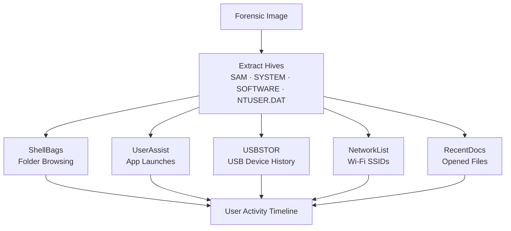

← [Back to Lab Index](README.md) | **Source:** [NDG Instructions (PDF)](Lab-04-Registry-Forensics-NDG-Instructions.pdf) · [Submission (PDF)](pdf/Lab-04-Registry-Forensics-Submission.pdf)

---

# Lab 04 — Windows Registry Forensics

**Week 9 — IT Security Forensics (CSC-7310)**

**Objective:** Extract and interpret forensic artifacts from Windows Registry hives to establish user activity, installed software, network history, and USB device connection history.

**Key Evidence:**

**Methodology:**

1. Extract registry hives from forensic image:
   - `%SystemRoot%\System32\config\SAM` (local accounts)
   - `%SystemRoot%\System32\config\SYSTEM` (devices, services, USB)
   - `%SystemRoot%\System32\config\SOFTWARE` (installed programs, run keys)
   - `C:\Users\<user>\NTUSER.DAT` (per-user activity)
   - `C:\Users\<user>\AppData\Local\Microsoft\Windows\UsrClass.dat` (shell activity)
2. Load hives in Registry Explorer / RegRipper.
3. Extract artifacts:
   - **ShellBags** (folders the user browsed)
   - **UserAssist** (GUI apps the user launched, with run counts and timestamps)
   - **RunMRU** (Win+R command history)
   - **RecentDocs** (recently-opened documents by extension)
   - **USBSTOR** (USB devices ever connected, serials, connection times)
   - **NetworkList** (Wi-Fi SSIDs connected to, timestamps)
4. Correlate findings into user-activity timeline.

**Key Findings / Outputs:**

- Extracted registry hives from forensic image: NTUSER.DAT from `Documents and Settings\IEUser\`, UsrClass.dat from `Documents and Settings\IEUser\Local Settings\Application Data\Microsoft\Windows\`, and system hives (SAM, SYSTEM, SOFTWARE, SECURITY) from `C:\Windows\System32\config\`.
- **RecentDocs:** Found `---README---.txt` at `C:\Documents and Settings\IEUser\Desktop\---README---.txt` — evidence of user accessing a suspicious file.
- **TypedURLs:** Recovered browser URL history with LastWrite timestamps from NTUSER.DAT, revealing web activity patterns.
- **USBSTOR:** Extracted USB device connection history — vendor IDs, product IDs, serial numbers, and first/last connection timestamps.
- **WinNT_CV:** Recovered OS installation date, build number, and registered owner from SOFTWARE hive.
- Registry analysis performed with **RegRipper v2.8** for automated artifact extraction.

**Applicable Standards:** NIST SP 800-86 §5.3 (Windows Artifact Analysis); SWGDE Best Practices for Windows Forensics.

**Tools:** FTK Imager (hive extraction), Registry Explorer (Eric Zimmerman), RegRipper v2.8, RECmd.

**Lessons Learned:**

- Registry is the **second most important forensic source** after the MFT — it persists across reboots and records user intent.
- UserAssist keys are ROT-13 encoded (historical obfuscation, trivially reversed).
- USB history is definitive for answering "did this device ever connect to this machine?"
- Per-user hives (`NTUSER.DAT`) must be extracted from each user's profile separately.

**What I Would Do Differently:** I would automate the full hive extraction and parsing pipeline using the `extract_registry_hives.sh` script from this portfolio, piped into RegRipper batch mode. This would produce a comprehensive HTML report in minutes rather than the manual hive-by-hive approach. I would also check for deleted registry keys using Registry Explorer's "recovered" view.

**Connects to:** Week 7 (recycle bin deletion events tied to user SID), Week 12 (log analysis correlates registry activity with event logs).

---

## Related

- **Previous:** [Lab 09 — Recycle Bin Forensics](lab-09-recycle-bin.md) (Week 7)
- **Next:** [Lab 16 — Mobile Forensics](lab-16-mobile-forensics.md) (Week 10)
- **[Lab Index](README.md)** — all 7 labs
