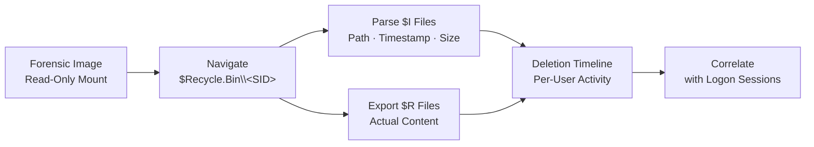

← [Back to Lab Index](README.md) | **Source:** [NDG Instructions (PDF)](Lab-09-Recycle-Bin-Forensics-NDG-Instructions.pdf) · [Submission (PDF)](pdf/Lab-09-Recycle-Bin-Forensics-Submission.pdf)

---

# Lab 09 — Recycle Bin Forensics

**Week 7 — IT Security Forensics (CSC-7310)**

**Objective:** Recover deleted files from the Windows Recycle Bin (`$Recycle.Bin`), parse `$I` and `$R` metadata files, and reconstruct the deletion timeline.

**Key Evidence:**

**Methodology:**

1. Mount the forensic image read-only.
2. Navigate to `C:\$Recycle.Bin\<SID>\` for each user account (SID from registry).
3. Enumerate `$I*` files (metadata: original path, deletion timestamp, file size).
4. Enumerate `$R*` files (the actual file content — still recoverable until emptied).
5. Parse `$I` files with forensic parser (e.g., `RBCmd.exe` by Eric Zimmerman).
6. Export recovered files and verify content.

**Key Findings / Outputs:**

- Identified two user SIDs with Recycle Bin activity:
  - `S-1-5-21-2000478354-688789844-1708537768-1003`
  - `S-1-5-21-1843218942-199276559-4149176266-1001`
- Extracted INFO2 file (pre-Vista format) and parsed with Rifiuti to recover deletion metadata.
- Extracted 5 `$I` files from SID folder `S-1-5-21-1843218942-...-1001` — each containing original path, deletion timestamp, and file size.
- Found deleted executables (`Dc1.exe`–`Dc4.exe`) in the RECYCLER folder — potential evidence of anti-forensics or malware cleanup.
- Reconstructed user's deletion activity timeline correlating SIDs with user accounts.

**Applicable Standards:** NIST SP 800-86 §5.2 (File Recovery); ISO/IEC 27037 §7.5 (Evidence Preservation).

**Tools:** FTK Imager (logical file export), Autopsy (case management), Rifiuti (INFO2 parser), RBCmd.exe, Windows SID resolution (`wmic useraccount get name,sid`).

**Lessons Learned:**

- Recycle Bin is a gold mine — users often assume delete = gone.
- `$I` format changed between Windows Vista and Windows 10+; parsers must support both.
- Empty Recycle Bin ≠ gone — file content may still be in unallocated clusters (see Week 9 registry + MFT).

**What I Would Do Differently:** I would cross-reference the deletion timestamps against Windows Event Log logon sessions (Event ID 4624/4634) to prove which user was logged in when each file was deleted. I would also check the `$MFT` for the original file creation timestamps to build a complete file lifecycle (created → modified → deleted).

**Connects to:** Week 9 (Registry — UserAssist shows what files user opened), Project 1 (timeline reconstruction).

---

## Related

- **Previous:** [Lab 10 — Steganography](lab-10-steganography.md) (Week 6)
- **Next:** [Lab 04 — Windows Registry Forensics](lab-04-registry-forensics.md) (Week 9)
- **[Lab Index](README.md)** — all 7 labs
