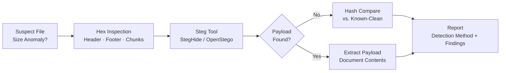

← [Back to Lab Index](README.md) | **Source:** [NDG Instructions (PDF)](Lab-10-Steganography-NDG-Instructions.pdf) · [Submission (PDF)](pdf/Lab-10-Steganography-Submission.pdf)

---

# Lab 10 — Steganography

**Week 6 — IT Security Forensics (CSC-7310)**

**Objective:** Detect and extract hidden payloads concealed within carrier files (images, audio, documents) using LSB-substitution, header-appending, and metadata-embedding techniques.

**Key Evidence:**

**Methodology:**

1. Examine suspected carrier files for size anomalies (file larger than expected for dimensions/format).
2. Use hex editor to inspect file headers, footers, and embedded chunks.
3. Use steganography tools (StegHide, OpenStego, or NDG-provided utility) to extract payloads.
4. Compare carrier file hashes against known-clean originals where available.
5. Document extracted payload and method of detection.

**Key Findings / Outputs:**

- Identified hidden content via Alternative Data Streams (ADS): `secret.txt` embedded as `Legitimate_program.exe:secret.txt` using the NTFS ADS colon syntax.
- Detection method: `dir /r` command reveals ADS attached to files — without this command, the hidden stream is invisible to standard directory listings.
- Hidden file creation technique: `Type legitimate_program.exe > Legitimate_program.exe:secret.txt` — demonstrates how trivially data can be concealed in NTFS.
- Produced analysis report showing detection method, extraction tool, and payload contents.

**Applicable Standards:** NIST SP 800-86 §5 (Examining and Analyzing Data); SWGDE Best Practices for Data Acquisition.

**Tools:** Hex editor (HxD / xxd), StegHide / OpenStego, file-type identification (`file` command, PE/JPEG header inspection), `dir /r` for ADS detection.

**Lessons Learned:**

- Steganography is **easy to miss** without suspicion — size anomaly is often the first (only) clue.
- NTFS Alternative Data Streams are a common hiding technique — always run `dir /r` or use Streams.exe (Sysinternals) on NTFS evidence.
- Modern forensic suites (AXIOM, Autopsy) include steganography detection modules but are not infallible.
- Passphrase recovery is often required — check for plaintext passphrase artifacts elsewhere in the case.

**What I Would Do Differently:** I would automate ADS scanning across the entire evidence drive using `streams.exe -s` (Sysinternals) or a PowerShell one-liner (`Get-ChildItem -Recurse | Get-Item -Stream *`). Manual `dir /r` is fine for targeted directories but doesn't scale to a full disk image.

**Connects to:** Week 7 (email forensics — attachments as steg carriers), Project 1 (hidden evidence artifacts).

---

## Related

- **Previous:** [Lab 01 — Creating a Forensic Image](lab-01-forensic-imaging.md) (Week 4)
- **Next:** [Lab 09 — Recycle Bin Forensics](lab-09-recycle-bin.md) (Week 7)
- **[Lab Index](README.md)** — all 7 labs
