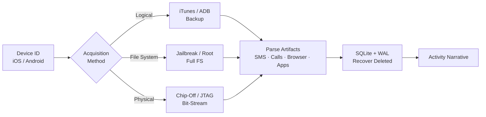

← [Back to Lab Index](README.md) | **Source:** [NDG Instructions (PDF)](Lab-16-Mobile-Forensics-NDG-Instructions.pdf) · [Submission (PDF)](pdf/Lab-16-Mobile-Forensics-Submission.pdf)

---

# Lab 16 — Mobile Forensics

**Week 10 — IT Security Forensics (CSC-7310)**

**Objective:** Perform forensic acquisition and analysis of a mobile device (iOS or Android), extract app data, and reconstruct user activity.

**Key Evidence:**

**Methodology:**

1. Identify device platform (iOS version / Android version).
2. Select acquisition method:
   - **Logical** (iTunes/ADB backup) — fastest, limited to user-visible data
   - **File system** (jailbreak/root required) — full filesystem access
   - **Physical** (chip-off, JTAG) — bit-stream of flash (destructive, specialized)
3. Extract backup / filesystem dump.
4. Parse common artifacts:
   - SMS/MMS databases (SQLite)
   - Call logs
   - Contacts
   - Browser history (Safari / Chrome)
   - App data (WhatsApp, Signal, Telegram)
   - Location history (GPS breadcrumbs in photos, Maps cache)
5. Correlate artifacts into user-activity narrative.

**Key Findings / Outputs:**

- Analyzed Android data partition (`vol15`) using Autopsy forensic suite.
- **Settings database:** Extracted device configuration from `data/com.android.providers.settings/databases/settings.db` — device identifiers, security settings.
- **Device identifiers:** Found IMEI, Google account registration data in `com.google.android.gms > shared_prefs > checkin.xml`.
- **Email artifacts:** Recovered complete email database `mailstore.cfttmobile1@gmail.com.db` containing emails with timestamps, senders, recipients, and attachments.
- **GPS/Location history:** Extracted navigation data from `da_destination_history` table — GPS coordinates, street addresses, and navigation timestamps establishing physical movement patterns.
- **Device hardware:** Recovered device model, manufacturer, serial number from `wpa_supplicant.conf`; SIM card data (ICCID, phone number, SIM operator) from `SimCard.dat`.

**Applicable Standards:** NIST SP 800-101 Rev. 1 (Guidelines on Mobile Device Forensics); SWGDE Best Practices for Mobile Phone Forensics.

**Tools:** Autopsy 4.13.0 (artifact extraction including call logs, messages, installed programs); conceptual coverage of Cellebrite UFED, Magnet AXIOM Mobile.

**Lessons Learned:**

- Mobile acquisition is **legally fraught** — often requires separate warrant from computer search.
- SQLite WAL files hold **uncommitted deletes** — check WAL before treating delete as permanent.
- iOS is more challenging than Android for non-jailbroken devices (encryption + sandboxing).
- App-layer artifacts (WhatsApp, Signal) are often more useful than OS-level artifacts.

**What I Would Do Differently:** I would prioritize extracting the SQLite WAL (Write-Ahead Log) files alongside the main databases — they often contain recently deleted records. I would also use `sqlitebrowser` to examine all databases for deleted rows (free-list pages) rather than relying solely on Autopsy's built-in parsers.

**Connects to:** Project 1 (mobile device as evidence source), Week 4 (acquisition verification).

---

## Related

- **Previous:** [Lab 04 — Windows Registry Forensics](lab-04-registry-forensics.md) (Week 9)
- **Next:** [Lab 17 — Log Capturing and Interpretation](lab-17-log-analysis.md) (Week 12)
- **[Lab Index](README.md)** — all 7 labs
