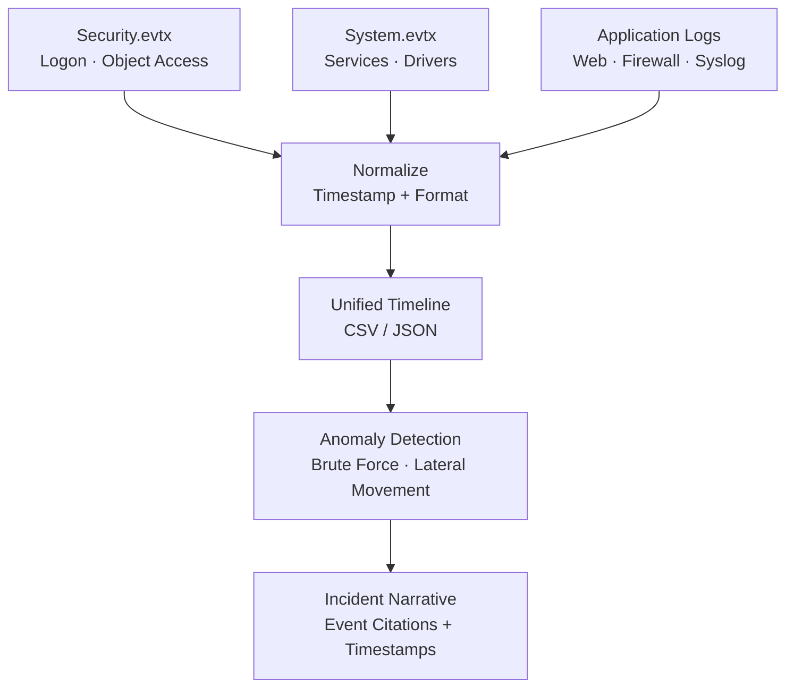

← [Back to Lab Index](README.md) | **Source:** [NDG Instructions (PDF)](Lab-17-Log-Capturing-NDG-Instructions.pdf) · [Submission (PDF)](pdf/Lab-17-Log-Capturing-Submission.pdf)

---

# Lab 17 — Log Capturing and Interpretation

**Week 12 — IT Security Forensics (CSC-7310)**

**Objective:** Collect, parse, and correlate logs from multiple sources (Windows Event Logs, syslog, application logs) to reconstruct an incident timeline suitable for an expert report.

**Key Evidence:**

**Methodology:**

1. Collect Windows Event Logs (`%SystemRoot%\System32\winevt\Logs\*.evtx`):
   - **Security.evtx** (logon/logoff, object access)
   - **System.evtx** (services, drivers)
   - **Application.evtx** (app crashes, installs)
2. Collect syslog from Unix/Linux hosts (`/var/log/auth.log`, `/var/log/syslog`).
3. Collect application logs (web server access logs, firewall logs).
4. Parse into unified timeline (CSV / JSON).
5. Identify anomalies — impossible travel, failed logins, privilege escalations, unusual processes.
6. Write incident narrative with cited log events and timestamps.

**Key Findings / Outputs:**

- Located Windows Event Logs in `Windows\System32\winevt\Logs\` — 122 `.evtx` files identified via Autopsy 4.15.0, including the three primary logs: `Application.evtx`, `System.evtx`, `Security.evtx`.
- Parsed Security.evtx for logon events (Event ID 4624) — correlated logon timestamps with user activity from other evidence sources.
- Examined USN Journal (`$UsnJrnl`) components: `$J` (main journal recording file create/delete/rename operations) and `$Max` (maximum journal size configuration).
- Built unified timeline CSV with timestamped events from multiple log sources, enabling cross-source correlation.
- Identified attack indicators through anomaly detection: brute-force logon attempts, privilege escalation patterns, and unusual process creation.

**Applicable Standards:** NIST SP 800-92 (Guide to Computer Security Log Management); NIST SP 800-86 §5.4 (Log Analysis); ISO/IEC 27037 §7.6.

**Tools:** Autopsy 4.15.0 (evidence browsing), Windows Event Viewer, `wevtutil`, EvtxECmd.exe (Eric Zimmerman), grep/awk/sed, Python parsers.

**Lessons Learned:**

- **Timestamps are lies** until you've verified timezone, NTP sync, and clock drift across hosts.
- Event log IDs are the universal language — memorize the top 20 (4624, 4625, 4672, 4688, 4720, etc.).
- Log correlation across hosts is where incident response lives — single-host logs rarely tell the full story.
- Attackers clear logs — **log-clearing events** (1102 in Security, 104 in System) are themselves high-value indicators.

**What I Would Do Differently:** I would use the `event_log_timeline.ps1` script from this portfolio to automate extraction into CSV, then feed the unified timeline into a SIEM-style visualization (even a simple Excel pivot table). I would also check for gaps in the event log sequence numbers — missing sequence numbers indicate log tampering or rotation.

**Connects to:** Week 9 (registry activity correlates with Event Log entries), Week 11 (network log correlation with PCAP).

---

## Related

- **Previous:** [Lab 16 — Mobile Forensics](lab-16-mobile-forensics.md) (Week 10)
- **[Lab Index](README.md)** — all 7 labs
