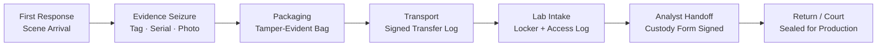
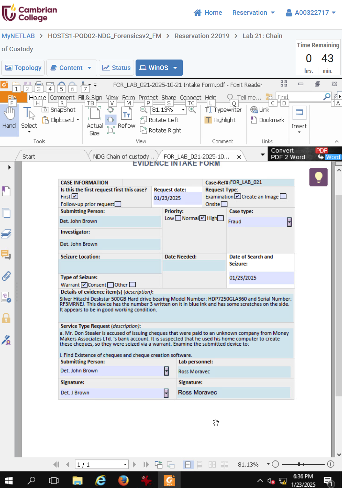

← [Back to Lab Index](README.md) | **Source:** [NDG Instructions (PDF)](Lab-21-Chain-of-Custody-NDG-Instructions.pdf) · [Submission (PDF)](pdf/Lab-21-Chain-of-Custody-Submission.pdf)

---

# Lab 21 — Chain of Custody

**Week 2 — IT Security Forensics (CSC-7310)**

**Objective:** Demonstrate the complete lifecycle of evidence custody from first response through courtroom admissibility. Document every transfer, every access, every handoff in accordance with ASCLD-Lab standards.

**Key Evidence:**

**Methodology:**

1. Simulated intake of a seized workstation from a company policy violation.
2. Completed chain-of-custody form (evidence tag, serial, hash values, seal number, intake officer).
3. Documented every subsequent handoff (analyst receipt, locker storage, return-to-requester).
4. Sealed evidence and verified tamper-evident packaging.

**Key Findings / Outputs:**

- A fully-populated chain-of-custody document with signatures at every transfer.
- Evidence item: Hitachi 500 GB HDD, serial-numbered and hash-tagged, requested by Det. John Brown; received by lab personnel (Ross Moravec).
- Evidence-bag seal verification log with tamper-evident seal numbers recorded at each transfer.
- Understanding that a **broken custody chain = inadmissible evidence** regardless of technical merit of the forensic work.

**Applicable Standards:** ASCLD-Lab / ISO 17025 lab certification; NIST SP 800-86 §4 (Evidence Collection); ACPO Good Practice Guide §3 (Principles of Digital Evidence).

**Tools:** Pen-and-paper forms (simulated), evidence tags, tamper-evident bags, locker with access log.

**Lessons Learned:**

- Custody is as much a legal/procedural discipline as a technical one.
- Every person touching evidence must be documented — including the analyst who does the imaging.
- Lab certification (ASCLD-Lab, ISO 17025) exists to enforce these procedures uniformly across practitioners.

**What I Would Do Differently:** In a real engagement, I would implement a digital chain-of-custody system (barcode + database) in addition to paper forms — paper is legally required but digital enables searchability and audit trails. I would also add photographic documentation of evidence seals at each transfer point.

**Connects to:** Week 1 (legal authority — search warrants must specify scope), Project 1 (case intake + custody).

---

## Related

- **Next:** [Lab 01 — Creating a Forensic Image](lab-01-forensic-imaging.md) (Week 4)
- **[Lab Index](README.md)** — all 7 labs
